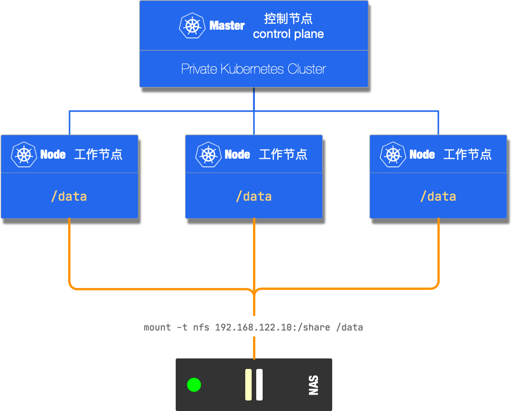

# Sharepath provisioner for Kubernetes

Fork basic code from [upstream](https://github.com/kubernetes-sigs/sig-storage-lib-external-provisioner/tree/master/examples/sharepath-provisioner)

```bash
make
```

## Intro

This provisioner is for following private kubernetes cluster deploy.



## Build & Push Image to Docker Hub

```shell
export IMAGE=poeticloud/sharepath-provisioner:v1.0.0
make
docker push $IMAGE
```

**IMPORTANT** If your os is not Linux , use docker to run above command.

```shell
docker run -it --rm -v $(pwd):/build -w /build golang:1.14 make sharepath-provisioner
export IMAGE={YOUR_USERNAME}/sharepath-provisioner:v1.0.X
make image
```
